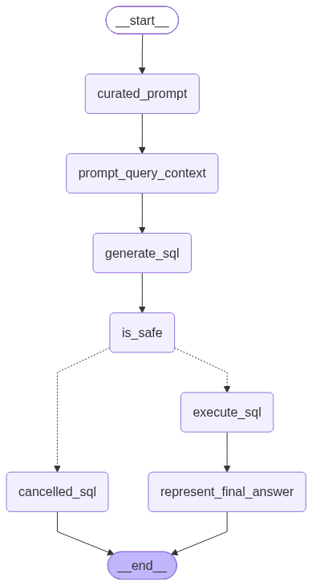
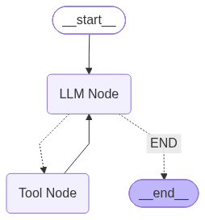

# End-to-End Data Agentic System
An Agentic Data Agent containing multiple agents for Updating SQL Queries and extracting/transforming files in any database of our choice. The System finds out the best agent to use from the given prompt of user and uses the respective tools to work out the solution. Due to mulitple LLMs (two use APIs and one local), hybrid searching is done using hybrid fusion (through Dense Vector and BM25 Lexical) and hybrid reranking using Cross-Encoder. ETL Pipelining is done for handling files. For Database Management, I used PostgreSQL using PGvector as the database engine.  

FLUX - Agentic Data Agent is designed to solve a major operational bottleneck in modern data teams: the constant influx of repetitive, low-leverage data requests from non-technical business stakeholders. Usually, a human data professional has to pause their high-value work (like building core infrastructure or machine learning models) to manually write SQL queries, fetch API payloads, and format data frames in Python. This project completely automates that junior data analyst workflow by building a stateful, multi-agent AI system that acts like an autonomous data team.  

## How the Solution Works in Practice:
The parent Data Agent acts like a Data Team Lead.  
When a non-technical user submits a request in messy, layman's English, the system routes and executes it through specific stages:  
1. The SQL Analyst Agent (For Database Queries)
- The Problem: Non-technical users cannot write code or formulate perfect prompt contexts, and standard LLMs will generate "garbage" SQL if they don't know your database schema.  
- The Fix: The agent takes a broken request, automatically extracts the schema context and sample data from your database (e.g., PostgreSQL), safely structures a bulletproof read-only query, executes it, and translates the raw database records back into a conversational, human-readable answer.  
2. The AI Guardrail Layer (For Data Security)
- The Problem: Blindly executing LLM-generated code on a production database introduces massive security risks, such as accidental data deletion or unauthorized data overrides (SQL Injection).  
- The Fix: The project implements AI as a Judge. A separate LLM strictly checks the generated query before it ever touches your server. If it detects unauthorized commands like DELETE or DROP, it blocks execution and explains why.  
3. The ETL Analyst Agent (For Data Engineering & Processing)
- The Problem: Databases don't hold all the answers. Sometimes data must be pulled dynamically from third-party vendor platforms or API endpoints.  
- The Fix: Using a programmatic ReAct tool-calling loop, this sub-agent dynamically selects code-driven tools to hit raw API endpoints, handles raw data parsing into Pandas DataFrames, applies script transformations (like filtering or sorting), and saves the clean file down locally.  
   
## LLMs Used:
High Level --> Gemini 3.6 flash  
Through API Key made from https://aistudio.google.com/api-keys  
  
Medium Level --> Nvidia Nemotron 3 Ultra (550B)  
Through API Key made from https://build.nvidia.com/settings/api-keys  
  
Low Level --> Ollama Qwen2.5-Coder (7B)  
Downloaded locally from Ollama  
  
Vector Folder is used to store the vector database for future use.  
Not added to GitHub for security reasons. Please create your own vector folder and add it to the .gitignore file.  
  
## Database:
- The PostgreSQL database is used to store the data extracted from files and transformed into a suitable format.  
- The database is used by the SQL Analyst Agent to execute SQL queries and fetch results based on the user's question.  
  
## FILES:
- main.py: The main entry point of the application. It calls the main Data Agent to process the user's question and route it to the appropriate agent (SQL Analyst or ETL Analyst) based on the context of the question and the database.  
  
- feed_db.py: This file is used for writing out data into the PostgreSQL database. It contains functions for extracting data from files, transforming it into a suitable format, and loading it into the PostgreSQL database.  
  It also contains functions for creating the necessary tables in the database if they don't already exist.  

- data_agent_graph.py: Image of the Data Agent Graph made after compilation of the configured graph from respective nodes and edges.  
  D:\Codes\DATA_AGENT\data_agent_graph.png
  
- sql_analyst_graph.py: Image of the SQL Analyst Graph made after compilation of the configured graph from respective nodes and edges.  
  D:\Codes\DATA_AGENT\sql_analyst_graph.png
  
- etl_analyst_graph.py: Image of the ETL Analyst Graph made after compilation of the configured graph from respective nodes and edges.  
  D:\Codes\DATA_AGENT\etl_analyst_graph.png
  
# Agents:
The Agents folder contains the implementation of the different agents used in the End-to-End Agentic System. Each agent is responsible for handling specific tasks related to the user's question and the database. The agents use LLMs to analyze the user's question and generate appropriate responses or actions.  
  
- agents/Data_Agent.py: This agent is responsible for routing the user's question to the appropriate agent (SQL Analyst or ETL Analyst) based on the context of the question and the database. It uses the LLMs to analyze the user's question and generate a response indicating which agent should handle the question.  
    

- agents/sql_analyst.py: This agent is responsible for analyzing the user's question, generating a SQL query, and executing it against the database. It uses the LLMs to curate the user's question into a more detailed prompt, generate the SQL query, and judge the safety of the generated SQL query.  
    

- agents/etl_analyst.py: This agent is responsible for processing messages related to ETL (Extract, Transform, Load) operations. It uses the LLMs to analyze the messages and generate appropriate responses or actions.
    
  
# Utils:
The Utils folder contains utility functions that are used by the agents to perform various tasks, such as interacting with the database, picking an LLM based on the user's question, and performing agentic operations.  
  
- utils/llm_pick.py: Used to pick an LLM out of the three LLMs (high, medium, low) based on the user's question and the context of the database.  

- utils/database.py: Contains utility functions for interacting with the database, such as executing SQL queries and fetching results.  

- utils/etl_tools.py: Contains utility functions for ETL operations, such as extracting data from files, transforming data, and loading data into the database.
  
# Models:
The Models folder contains Pydantic models for validating the input and output data structures used by the agents by defining schemas for all of the agents.  
  
- models/schema.py: Contains Pydantic models for validating the input and output data structures used by the agents. It defines schemas for the SQL Analyst Agent, ETL Analyst Agent, LLM as a Judge, and Data Agent.  
  
# Data:  
The data folder contains the datasets used for training and testing the agents. It includes CSV files, JSON files, and other data formats.  

- data/extractions: Folder containing extracted data files used for extraction by the ETL Analyst Agent.  
  
- data/tranformations: Folder containing transformed data files which are loaded after transformation by the ETL Analyst Agent.  
  
  
## Future Improvements:  
  
To make it work reliably, you need to do one of these:  
  
switch to a model/provider that supports structured output  
remove with_structured_output(...) and parse plain-text JSON manually  
keep the route logic but avoid the incompatible backend  
